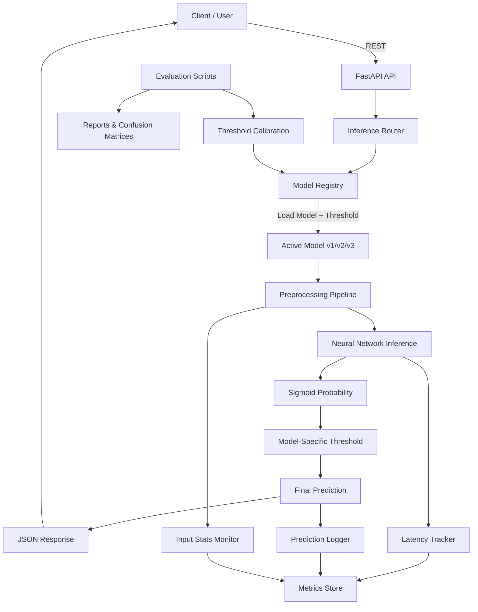
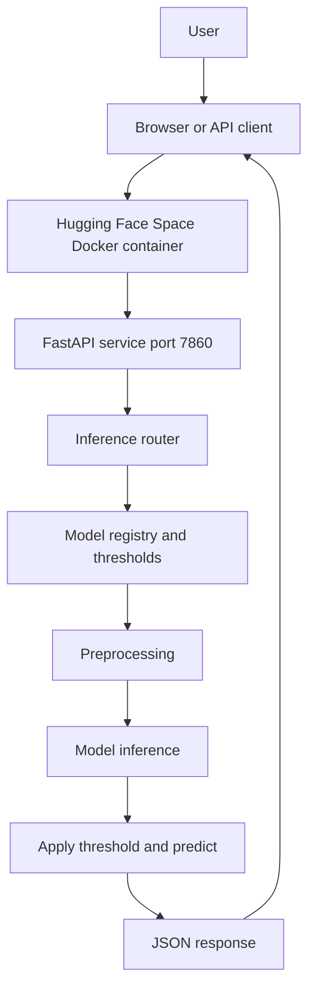
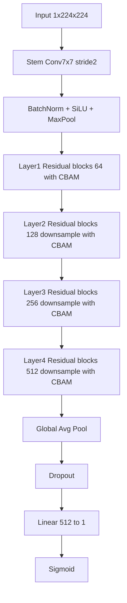
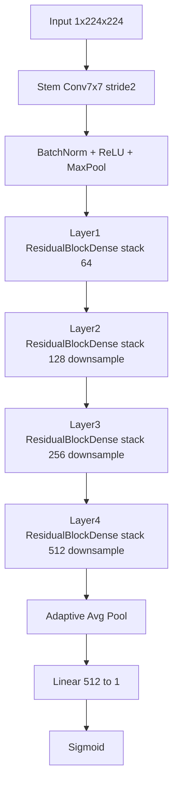
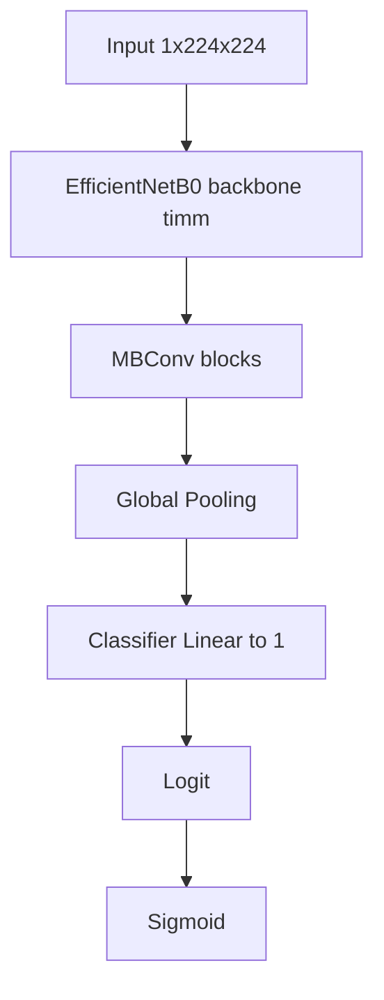

# PneumoAI — End-to-End Pneumonia Detection System (Research → Production)

PneumoAI is a **production-oriented machine learning system** for detecting **Pneumonia vs Normal** from chest X-ray images.  
What began as a focused **model research project** has evolved into a **system-level ML application** with **clear MLOps foundations, a defined MVP scope, and production-style workflows**.

The project is currently in a **system testing and continuous evaluation stage**, where model behavior, serving reliability, and monitoring signals are actively validated and refined.No Gradio is used in the deployed Space.

---

## Live Demo (Hugging Face Spaces)

**FastAPI (Swagger / OpenAPI Docs):**  
https://thiyaga158-pneumonia-detection-ml-system.hf.space/docs#/

---

## Project Purpose

Pneumonia is a serious lung infection that can be fatal if not detected early. Chest X-rays provide a widely available, non-invasive diagnostic signal, but interpretation requires expertise and is subject to variability.

PneumoAI aims to:
- Automatically classify chest X-rays as **Pneumonia** or **Normal**
- Deliver **high diagnostic performance using data-driven, model-specific thresholds**
- Demonstrate **how real ML systems are built, deployed, monitored, and evolved**—not just trained in notebooks
- Deployment-ready APIs and interactive UIs

Each model version is treated as an **independent experiment**, not as incremental fine-tuning of the same network.

---

## High-Level System Overview

This repository contains:
- **Three architecturally distinct models (v1, v2, v3)**  
- **Model-specific decision thresholds**, derived from each model's own validation data  
- A **version-agnostic inference system** capable of serving any model without code changes  
- **Core MLOps components**: versioning, evaluation, observability, rollback readiness  
- Deployment-ready APIs and interactive UIs  

Each model version is treated as an **independent experiment**, not as incremental fine-tuning of the same network.

---

## Model Versions & Architectures

| Version | Model Name              | Architecture Type                         | Threshold Source                |
|---------|-------------------------|-------------------------------------------|---------------------------------|
| v1      | ImprovedPneumoniaCNN    | Custom CNN + Residual + CBAM              | v1 validation data              |
| v2      | DeepResNet              | Deep ResNet-style CNN (from scratch)      | v2 validation data              |
| v3      | EfficientNet-B0         | Transfer learning (EfficientNet backbone) | v3 validation data              |

**Key principle**:
- Thresholds are **not hard-coded**
- Each model operates at its **own optimal decision point**
- The inference system automatically loads the **correct threshold per model**

---

## Core MVP Scope (What This System Guarantees)

PneumoAI's **Minimum Viable ML System (MVP)** explicitly includes:

### Model Layer
- Independently trained and validated models
- Explicit model versioning (`v1`, `v2`, `v3`)
- Reproducible architectures and preprocessing

### Inference Layer
- Stateless inference API (FastAPI)
- Interactive human-facing UI (Gradio)
- Deterministic preprocessing and prediction flow

### Decision Layer
- Sigmoid probability output
- **Model-specific thresholds**
- Consistent classification logic across deployments

### Evaluation Layer
- Offline evaluation scripts
- Confusion matrices and CSV metrics
- Threshold calibration based on validation ROC/F1 trade-offs

### Observability Layer
- Latency tracking (mean, p95)
- Prediction logging
- Input distribution monitoring
- Metrics persistence for system testing

This MVP ensures the system is **testable, debuggable, and evolvable**—not just accurate.

---

## Explicit MLOps Features Implemented

This project **does include real MLOps components**, intentionally scoped for clarity rather than tooling overload.

### 1. Model Versioning
- Models stored and served by explicit version (`models/v1`, `models/v2`, `models/v3`)
- Architecture + weights + threshold treated as a **single versioned artifact**
- Version switching without API/UI changes

### 2. Reproducible Preprocessing
- Single shared preprocessing pipeline
- Black padding, grayscale conversion, normalization
- Training and inference parity enforced

### 3. Evaluation & Validation Artifacts
- Confusion matrices saved per model
- CSV-based metric reports
- Thresholds derived from validation—not guessed

### 4. Observability (Foundational)
- Latency measurement per request
- Prediction distribution logging
- Input statistics monitoring (drift signals)
- Metrics store abstraction (extensible)

### 5. Deployment Readiness
- Dockerfile included
- Stateless inference design
- Cloud-agnostic architecture (VM, K8s, HF Spaces)

### 6. System Testing Orientation
- Not "set-and-forget" deployment
- Continuous evaluation mindset
- Drift detection hooks (experimental, controlled)

> This is **intentional MLOps minimalism**:  
> core lifecycle concepts are implemented **without hiding them behind heavy platforms**.

---

## Research & Modeling Evolution (Condensed)

- Initial shallow CNN → underfitting  
- Deeper custom CNN → capacity gains  
- Transfer learning → stability vs control trade-offs  
- Dataset bottleneck identified and resolved  
- Final models validated on **22,000+ balanced X-rays**

Black padding, CBAM attention, residual connections, and EfficientNet backbones were all **experimentally justified**, not arbitrarily chosen.

---

## System Architecture

PneumoAI follows a layered ML system design: **Interface → Inference Router → Model Registry → Preprocess → Inference → Thresholding → Response**, with observability and offline evaluation connected.



---

### Deployment Architecture (Docker & Cloud-Ready)



---

## Model-Internal Architecture Diagrams
### v1 — ImprovedPneumoniaCNN (Custom + CBAM)


### v2 — DeepResNet (From Scratch)


### v3 — EfficientNet-B0 (Transfer Learning)


---

## Installation & Execution

This project is designed to run both locally and in containerized environments. The instructions below reflect the actual runtime assumptions of the system.

### System Requirements

#### Python
* Python 3.9 or 3.10 (recommended)
* Python 3.11 is not tested

#### Hardware
* CPU-only execution is fully supported
* GPU (CUDA) is optional and automatically used if available
* No GPU-specific code paths are required

#### Operating System
* Tested on:
   * Windows 10/11
   * Linux (Ubuntu)
* macOS should work, but is not actively tested

### Environment Setup (Local)

It is strongly recommended to use a virtual environment.

Option 1: `venv`
```bash
python -m venv venv
source venv/bin/activate   # Linux/macOS
venv\Scripts\activate      # Windows
```

Option 2: Conda
```bash
conda create -n pneumonia python=3.9
conda activate pneumonia
```

### Install Dependencies

From the project root:
```bash
pip install -r requirements.txt
```

Key dependencies include:
* PyTorch
* FastAPI
* Uvicorn
* NumPy
* Pillow
* SQLite (built-in)

### Model Files & Registry

The system expects pretrained models to be present locally.

Model Directory Structure
```
models/
├── v1/
│   ├── model.pth
│   └── threshold.json
├── v2/
│   ├── model.pth
│   └── threshold.json
├── v3/
│   ├── model.pth
│   └── threshold.json
├── baseline_hist_v1.json
└── registry.json
```

### Model Selection Logic

The served model is determined only by:
```
models/registry.json
```

Example:
```json
{
  "current": "v3",
  "previous": "v2",
  "available": ["v1", "v2", "v3"]
}
```

* The API always loads `current`
* Switching models does not require code changes
* Promotion / rollback updates the registry and reloads the model in memory

## Running the API Server

### Local Execution (Development)

From the project root:
```bash
export PYTHONPATH=.
python src/run_api.py
```

On Windows PowerShell:
```powershell
$env:PYTHONPATH="."
python src\run_api.py
```

Expected Startup Logs

A successful startup will look like:
```
INFO:     Loading model version: v1
INFO:     Device: cpu
INFO:     Initializing request database
INFO:     Application startup complete.
INFO:     Uvicorn running on http://0.0.0.0:8000
```

If you see these logs, the system is fully operational.

### Docker Execution (Recommended for Deployment)

The project is fully Dockerized and designed to run cleanly in Hugging Face Docker Spaces or any standard container runtime.

Build Image
```bash
docker build -t pneumonia-ml-system .
```

Run Container
```bash
docker run -p 8000:8000 pneumonia-ml-system
```

The API will be available at:
```
http://localhost:8000
```

API Usage

The system exposes a clean REST API via FastAPI.

Base URL
```
http://<host>:8000
```

Health Check

Endpoint
```
GET /health
```

Response
```json
{
  "status": "ok",
  "device": "cpu",
  "model_version": "v1"
}
```

Prediction Endpoint

Endpoint
```
POST /predict
```

Content-Type
```
multipart/form-data
```

Input
* `file`: chest X-ray image
* Accepted formats: `.png`, `.jpg`, `.jpeg`

Example (curl)
```bash
curl -X POST "http://127.0.0.1:8000/predict" \
  -F "file=@chest_xray.png"
```

Successful Response
```json
{
  "label": "Pneumonia",
  "probability": 0.982143,
  "threshold": 0.5,
  "latency_ms": 54.3,
  "model_version": "v1"
}
```

## Prediction Logic (Explicit)

* Model outputs a single logit
* Probability = `sigmoid(logit)`
* Decision rule:
```
Pneumonia if probability ≥ threshold
```

* Default threshold = 0.5
* Per-version thresholds can be configured via `threshold.json`

Error Handling

If inference fails:
```json
{
  "error": "Invalid image file"
}
```

All errors are:
* Logged to the request database
* Associated with model version and timestamp

## Admin & Operations API

These endpoints exist to operate the system, not for end users.

Registry Status
```
GET /admin/status
```

Reload Model (in-memory)
```
POST /admin/reload
```

Promote Model
```
POST /admin/promote/v2
```

Drift Check + Rollback
```
GET /admin/drift?window=50&threshold=0.25
```

---

## Project Status

**System Testing & Continuous Evaluation Phase**

Actively validating:
- inference stability
- latency behavior
- threshold correctness

Architecture intentionally open for:
- retraining
- drift handling
- future CI/CD integration

---

## License

Licensed under the Apache License 2.0.  
See the LICENSE file for details.

---

## Closing Note

PneumoAI is not just a trained model.  
It is a minimum viable ML system with real MLOps thinking, designed to evolve safely over time.
