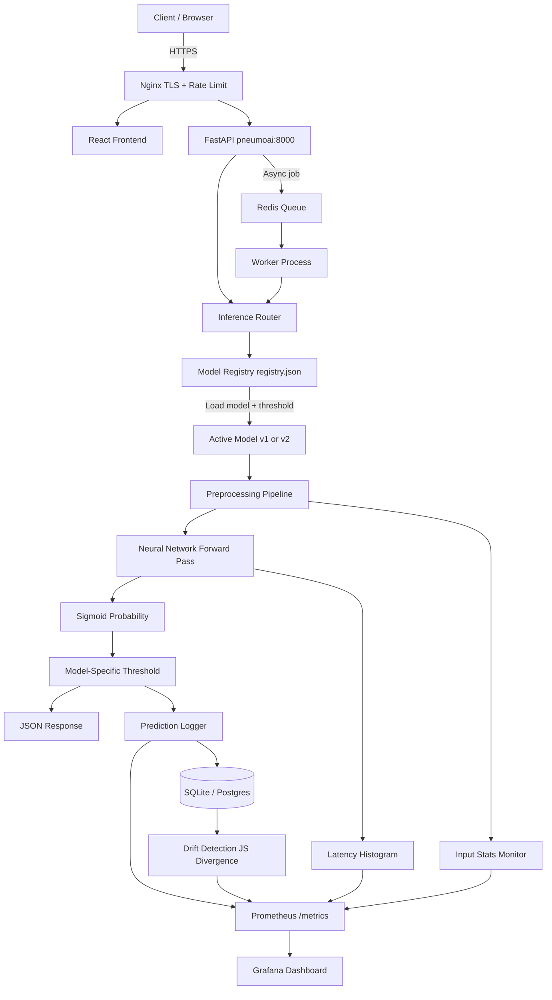
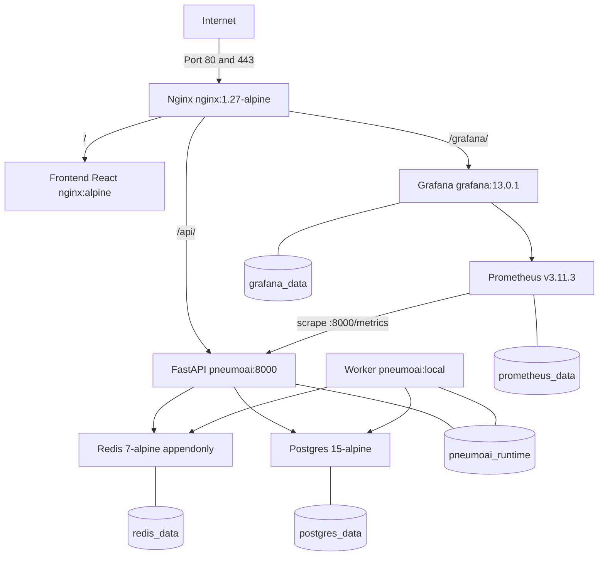
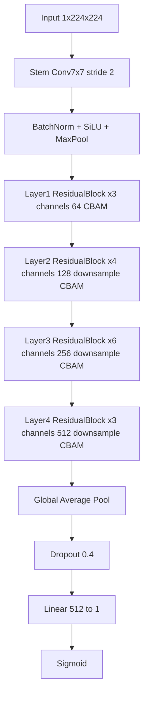
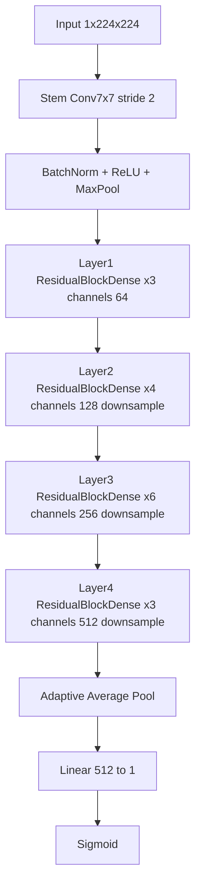
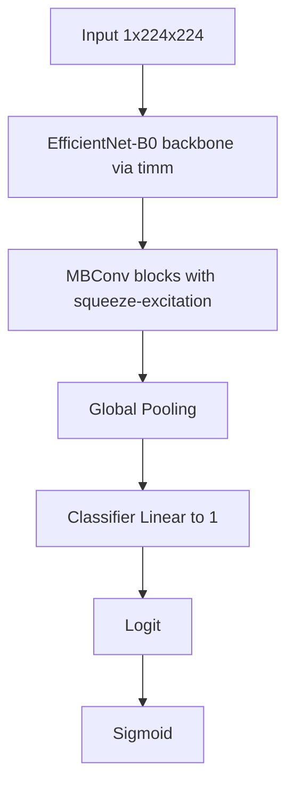

# PneumoAI

PneumoAI is a production-grade machine learning system for classifying chest X-rays as **Pneumonia** or **Normal**. The project is not a research notebook or a demo. It is a working ML system with a serving layer, async processing, monitoring, deployment infrastructure, and a gated model promotion pipeline.

The current production deployment runs at [https://api.thiyaga.dev](https://api.thiyaga.dev) with the full VM stack described below.

---

## Table of Contents

- [Why This Project Exists](#why-this-project-exists)
- [What the System Does](#what-the-system-does)
- [System Architecture](#system-architecture)
- [Production Deployment Architecture](#production-deployment-architecture)
- [Model Versions and Architectures](#model-versions-and-architectures)
- [MLOps Design](#mlops-design)
- [Observability](#observability)
- [Repository Structure](#repository-structure)
- [Running Locally](#running-locally)
- [Running with Docker Compose](#running-with-docker-compose)
- [API Reference](#api-reference)
- [Admin and Operations API](#admin-and-operations-api)
- [Model Promotion and Rollback](#model-promotion-and-rollback)
- [Drift Detection](#drift-detection)
- [Evaluation Results](#evaluation-results)
- [Project Status](#project-status)
- [License](#license)

---

## Why This Project Exists

Pneumonia is a leading cause of mortality worldwide and chest X-ray interpretation is the primary diagnostic method. Radiologist availability varies significantly across healthcare settings, and reading variability between clinicians is a documented problem.

This project demonstrates how a reliable, observable ML system for medical image classification can be built, served, and operated. The emphasis is on production thinking from the start: model versioning, threshold calibration per model, async inference, monitoring with Prometheus and Grafana, gated promotion, and rollback capability.

No part of this codebase exists to look good in a notebook. Everything is wired to run in production.

---

## What the System Does

A client submits a chest X-ray image via REST API. The system preprocesses the image, runs inference through the active model, applies a model-specific decision threshold, and returns a structured JSON response with the classification, probability, latency, and model version. All predictions are persisted to a database for audit, evaluation, and drift analysis.

The same image submission flow is available both as a synchronous endpoint and as an asynchronous job via a Redis-backed queue, processed by a separate worker process.

A React frontend provides a web UI for direct interaction. Prometheus scrapes metrics from the API. Grafana visualizes service health, throughput, latency, and drift signals. Nginx handles TLS termination and rate limiting in production.

---

## System Architecture

The system is organized into layers: request ingestion, inference routing, model registry, preprocessing, inference execution, threshold application, response, and observability. The diagram below reflects the actual code paths.



### Key design decisions

The inference router loads the active model version at startup and caches the model bundle in memory. Switching models does not require a code change or a redeployment. You update `models/registry.json` and call the reload endpoint, or the system promotes a new version through the gated promotion API.

Preprocessing is enforced identically at training time and inference time: grayscale conversion, black padding to preserve aspect ratio, resize to 224x224, and normalization with ImageNet statistics. Training and inference parity is not assumed. It is tested.

Decision thresholds are not hardcoded to 0.5. Each model version carries its own threshold derived from ROC and F1 analysis on that model's validation data. The threshold is stored alongside the model weights in `models/vN/threshold.json` and loaded automatically.

---

## Production Deployment Architecture

The VM deployment uses Docker Compose and runs at `api.thiyaga.dev`.



The full production stack is defined in `docker-compose.vm.yml`. Key points:

- Nginx handles TLS via Let's Encrypt certificates and applies a rate limit of 5 requests per second per IP to the API. The `/metrics` endpoint is blocked at the proxy layer and is not externally accessible.
- The FastAPI container and the worker container run from the same image but with different entrypoints. The API handles synchronous predictions and job submission. The worker polls the Redis queue and processes async jobs.
- Prometheus and Grafana run as containers with persistent volumes. The Grafana admin dashboard is available at `/grafana/` and provisioned from `infra/grafana/`.
- Postgres replaces SQLite in the VM deployment for prediction audit logging. The schema is the same; only the connection string changes via environment variable.
- All services use `restart: unless-stopped`. Health checks are defined for Redis, Postgres, the API, and the frontend. The worker waits for both Redis and Postgres to be healthy and the API to pass its health check before starting.

---

## Model Versions and Architectures

Three architecturally distinct models were trained independently. Each is treated as a separate experiment, not an incremental update to the same network.

| Version | Class Name | Architecture | Accuracy | AUC | F1 |
|---------|-----------|-------------|----------|-----|----|
| v1 | ImprovedPneumoniaCNN | Custom CNN + Residual blocks + CBAM attention | 96.76% | 0.9959 | 96.85% |
| v2 | DeepResNet | Deep ResNet-style CNN built from scratch | 96.98% | 0.9952 | 97.05% |
| v3 | EfficientNet-B0 | Transfer learning via timm EfficientNet backbone | 96.90% | 0.9972 | 96.95% |

All models accept single-channel grayscale images at 224x224 resolution and produce a single logit. The sigmoid of that logit is the pneumonia probability. Final classification applies the per-version threshold from `threshold.json`.

The current production model is **v2** (promoted via the gated promotion API on 2026-04-24). v3 is not currently deployed because it was trained before the full VM stack was available and has not been evaluated against the gated promotion criteria in the production environment.

### v1 — ImprovedPneumoniaCNN (Custom CNN with CBAM)



CBAM (Convolutional Block Attention Module) applies both channel attention and spatial attention within each residual block. Channel attention uses global average pooling followed by a two-layer MLP and sigmoid gating to rescale features by channel importance. Spatial attention concatenates average-pooled and max-pooled feature maps across the channel dimension, passes them through a 7x7 convolution, and applies sigmoid gating spatially. This was chosen over simpler SE blocks after observing that spatial attention improved recall on low-contrast X-rays. The activation function is SiLU throughout rather than ReLU, which provided modest but consistent gains in validation loss.

### v2 — DeepResNet (From scratch)



v2 uses a standard ResNet-style architecture built entirely from scratch, without pretrained weights. The motivation was to understand whether a deeply trained custom network could match transfer learning on this specific domain. It is the current production champion, having passed the gated promotion gate against v1 on F1, recall, and P95 latency criteria.

### v3 — EfficientNet-B0 (Transfer learning)



v3 uses a pretrained EfficientNet-B0 backbone loaded through the `timm` library, with the classifier head replaced for binary output. Transfer learning introduces a different trade-off: the backbone generalizes well and trains fast, but the model carries ImageNet priors that are not necessarily appropriate for grayscale medical images. The model achieves the highest AUC (0.9972) of the three but has not been promoted because it predates the production evaluation pipeline.

---

## MLOps Design

### Model versioning

Each model version is a directory under `models/` containing three artifacts: `model.pth` (weights), `threshold.json` (decision threshold derived from validation data), and any metadata. The registry file `models/registry.json` controls which version is active and maintains a full promotion history with timestamps, run IDs, and notes.

```json
{
  "current": "v2",
  "previous": "v1",
  "available": ["v1", "v2"],
  "history": [
    {
      "event": "bootstrap",
      "version": "v1",
      "previous": null,
      "promoted_by": "system",
      "timestamp": "2026-04-23T00:00:00Z"
    },
    {
      "event": "promote",
      "version": "v2",
      "previous": "v1",
      "run_id": "c92cc3793ae64c6fb5b5c9dced9a386e",
      "notes": "real-v2-gated-promotion",
      "promoted_by": "admin_api",
      "timestamp": "2026-04-24T06:15:46.165831+00:00"
    }
  ]
}
```

### Gated model promotion

Promotion is not a manual file edit. The `POST /admin/promote/{version}` endpoint triggers a promotion gate that compares the candidate model's metrics against the current champion across three criteria: F1 score must not decrease, recall must not decrease (recall is prioritized because false negatives carry higher clinical cost in pneumonia screening), and P95 latency must not exceed the champion by more than 10%. A promotion is blocked if any criterion fails, and the gate response explains which criteria were not met.

```python
# src/pneumoai/mlops/promotion_gate.py
def should_promote(candidate: dict, champion: dict) -> tuple[bool, list[str]]:
    reasons: list[str] = []
    if candidate_f1 < champion_f1:
        reasons.append(...)
    if candidate_recall < champion_recall:
        reasons.append(...)
    if candidate_latency > champion_latency * 1.10:
        reasons.append(...)
    return len(reasons) == 0, reasons
```

A successful promotion updates the registry, clears the in-memory model cache, and reloads the new model. MLflow run tags are updated if a run ID was provided. Rollback follows the same path in reverse.

### Threshold calibration

Thresholds are derived per model from validation data using ROC curve and F1 maximization, not assumed to be 0.5. The calibration is done offline during training and stored in `threshold.json`. The inference service reads this file at model load time. Changing the threshold for a deployed model does not require a code change: update the file and reload via `POST /admin/reload`.

### Experiment tracking

Training runs are tracked with MLflow. The tracking URI defaults to a local SQLite file at `data/runtime/mlflow.db` and is configurable via environment variable. Promoted models have their MLflow runs tagged with promotion metadata.

### Async inference

The `POST /predict` endpoint enqueues a prediction job to a Redis queue and returns a job ID immediately. A separate worker process polls the queue, runs inference, and persists the result. The worker is aware of the current model version from the same registry used by the API. This design allows the API to remain responsive under load and supports horizontal scaling of workers independently of the API.

---

## Observability

### Metrics

The application exports Prometheus metrics at `GET /metrics`. The endpoint is served from the FastAPI process using the `prometheus_client` multiprocess collector, which correctly aggregates metrics across multiple worker processes. The following metrics are exported:

| Metric | Type | Description |
|--------|------|-------------|
| `pneumoai_prediction_requests_total` | Counter | Total prediction requests received |
| `pneumoai_prediction_errors_total` | Counter | Total prediction errors |
| `pneumoai_prediction_latency_ms` | Histogram | Prediction latency in ms, buckets at 10/25/50/100/250/500/1000/2000/5000 |
| `pneumoai_async_requests_total` | Counter | Async jobs submitted |
| `pneumoai_async_completions_total` | Counter | Async jobs completed by workers |
| `pneumoai_admin_actions_total` | Counter | Admin API calls by action label |
| `pneumoai_drift_checks_total` | Counter | Number of drift checks triggered |
| `pneumoai_drift_js_divergence` | Histogram | Jensen-Shannon divergence scores from drift checks |

Process and Go runtime metrics from Prometheus itself are also available. The `/metrics` endpoint is blocked at the Nginx layer in production and is not externally accessible.

### Prometheus configuration

Prometheus is configured in `infra/prometheus/prometheus.yml`. It scrapes the API at 15-second intervals.

```yaml
global:
  scrape_interval: 15s

scrape_configs:
  - job_name: "pneumoai-api"
    metrics_path: /metrics
    static_configs:
      - targets:
          - "pneumoai:8000"

  - job_name: "prometheus"
    static_configs:
      - targets:
          - "localhost:9090"
```

### Grafana dashboard

A production operations dashboard is provisioned at `infra/grafana/dashboards/pneumoai-overview.json`. It covers five areas:

**Service Health** (stat panels): API up/down, Prometheus up/down, total predictions in range, async completions in range, error rate percentage with GREEN/YELLOW/RED thresholds, async success rate with RED below 95%.

**Throughput** (timeseries): Prediction requests per second, prediction errors per second, async submitted vs completed per second on a single chart for backlog visibility.

**Latency** (timeseries): P50/P95/P99 latency percentiles on one chart, average latency on a separate chart.

**Runtime Health** (timeseries): API and Prometheus memory in MB, API CPU in cores, drift checks and JS divergence score on a dual-axis chart.

**Model Performance and Infrastructure** (collapsed row): Placeholder panels for confidence distribution, false positive rate, false negative rate, model version info, queue length, average queue wait, inference device, and GPU utilization. These are documented with the planned metric names for future wiring.

All timeseries panels use `[$__rate_interval]` for rate calculations, not hardcoded intervals. The dashboard auto-refreshes every 30 seconds and defaults to a 30-minute time window. Dark theme is enforced.

### Drift detection

The drift detection endpoint computes Jensen-Shannon divergence between the probability distribution of recent predictions and a stored baseline distribution for the active model version. The baseline is stored at `models/baseline_hist_vN.json` and built from the validation set at training time. When drift is detected, the JS divergence score is observed into the `pneumoai_drift_js_divergence` histogram and is visible in Grafana.

```
GET /drift?version=v2&limit=500&threshold=0.08
```

A JS divergence above the threshold indicates that the distribution of incoming X-rays has shifted away from what the model was trained on. This is not an automatic rollback trigger. It is a signal for manual investigation.

---

## Repository Structure

```
.
|-- Dockerfile                        # Production image (Python 3.11 slim)
|-- docker-compose.yml                # Local development stack
|-- docker-compose.vm.yml             # Full VM production stack
|-- docker-compose.prod.yml           # Alternative production variant
|-- docker-compose.release.yml        # Release build config
|-- requirements.txt                  # Full dependencies
|-- requirements-serving.txt          # Serving-only dependencies (used in image)
|-- requirements-ci.txt               # CI dependencies
|-- requirements.lock.txt             # Pinned lock file
|-- models/
|   |-- registry.json                 # Active model version and promotion history
|   |-- baseline_hist_v1.json         # Baseline probability distribution for v1 drift
|   |-- v1/
|   |   |-- model.pth                 # v1 weights
|   |   `-- threshold.json            # v1 decision threshold
|   `-- v2/
|       |-- model.pth                 # v2 weights
|       `-- threshold.json            # v2 decision threshold
|-- src/
|   `-- pneumoai/
|       |-- common/                   # Settings, logging, IDs
|       |-- contracts/                # Pydantic request/response schemas
|       |-- mlops/                    # Promotion gate, promotion service, MLflow registry
|       |-- models/                   # Architectures, loader, factory, registry
|       |-- monitoring/               # Prometheus metrics, drift detection, audit store
|       |-- preprocessing/            # Image preprocessing pipeline, upload validation
|       |-- queue/                    # Redis job enqueue/dequeue, worker loop
|       |-- serving/
|       |   |-- api/
|       |   |   |-- app.py            # FastAPI application, lifespan, middleware
|       |   |   |-- routes_predict.py # POST /predict-sync
|       |   |   |-- routes_async.py   # POST /predict, GET /predict/{job_id}
|       |   |   |-- routes_health.py  # GET /health, /ready, /drift, /metrics
|       |   |   `-- routes_admin.py   # GET|POST /admin/*
|       |   `-- dispatcher/           # Inference service, model bundle cache
|       `-- storage/                  # SQLite and Postgres storage adapters
|-- scripts/
|   `-- run_worker.py                 # Worker entrypoint
|-- frontend/                         # React + Vite + TypeScript UI
|-- infra/
|   |-- nginx/                        # Nginx config with TLS and rate limiting
|   |-- prometheus/                   # Prometheus scrape config
|   `-- grafana/
|       |-- provisioning/             # Grafana datasource and dashboard provisioning
|       `-- dashboards/               # pneumoai-overview.json dashboard
|-- Evaluation_Reports/
|   `-- evaluation_metrics.csv        # Per-model accuracy, AUC, F1, loss
|-- Notebooks/                        # Training notebooks (v1, v2, v3)
|-- mlruns/                           # Local MLflow tracking data
`-- artifacts/                        # Saved model artifacts from training runs
```

---

## Running Locally

### Requirements

Python 3.9 or 3.10 is recommended. Python 3.11 is used in the production image and works. Redis is required for the async queue. It can be run via Docker without installing locally.

The system runs on CPU by default. GPU is detected automatically if CUDA is available. No GPU-specific configuration is required.

Tested on Linux (Ubuntu) and Windows 10/11. macOS is not actively tested but should work.

### Environment setup

```bash
python -m venv venv
source venv/bin/activate      # Linux and macOS
venv\Scripts\activate         # Windows PowerShell
pip install -r requirements.txt
```

### Start Redis (if running async endpoints)

```bash
docker run -d -p 6379:6379 redis:7-alpine
```

### Run the API

```bash
export PYTHONPATH=.
python src/run_api.py
```

On Windows PowerShell:

```powershell
$env:PYTHONPATH="."
python src\run_api.py
```

A successful startup produces:

```
INFO  application_startup environment=dev backend=local
INFO  validating_model_artifacts model_version=v2
INFO  model_warmed_on_startup model_version=v2 backend=local device=cpu
INFO  Uvicorn running on http://0.0.0.0:8000
```

The interactive API docs are available at `http://localhost:8000/docs`.

### Run the worker (for async predictions)

```bash
export PYTHONPATH=.
python scripts/run_worker.py
```

---

## Running with Docker Compose

The development stack brings up Redis, the API, and the worker:

```bash
docker compose up --build
```

The API is available at `http://localhost:8080`.

The full VM production stack including Nginx, Postgres, Prometheus, Grafana, and the frontend:

```bash
docker compose -f docker-compose.vm.yml up --build
```

An `.env.production` file is required for the VM stack. At minimum it must set:

```
POSTGRES_PASSWORD=<password>
ADMIN_API_KEY=<key>
```

---

## API Reference

### Health

```
GET /health
```

Returns `{"status": "ok"}` if the process is running. Does not check model or database state.

```
GET /ready
```

Validates model artifacts and database connectivity. Returns model version and device.

```json
{
  "status": "ready",
  "model_version": "v2",
  "device": "cpu",
  "backend": "local"
}
```

### Synchronous prediction

```
POST /predict-sync
Content-Type: multipart/form-data

file: <image file>           # Required. .png .jpg .jpeg accepted
true_label: <string>         # Optional. For evaluation logging
```

```json
{
  "label": "Pneumonia",
  "probability": 0.982143,
  "threshold": 0.47,
  "latency_ms": 54.3,
  "model_version": "v2",
  "request_id": "req_abc123"
}
```

The threshold value in the response is the per-model threshold, not a hardcoded 0.5.

```bash
curl -X POST https://api.thiyaga.dev/api/predict-sync \
  -F "file=@chest_xray.png"
```

### Asynchronous prediction

Submit a job:

```
POST /predict
Content-Type: multipart/form-data

file: <image file>
```

Returns a job ID immediately:

```json
{"job_id": "job_xyz789", "status": "queued"}
```

Poll for result:

```
GET /predict/{job_id}
```

Returns the same structure as the synchronous response once complete, or `{"status": "pending"}` while the worker is processing.

### Prediction decision logic

```
probability = sigmoid(model_logit)
label = "Pneumonia" if probability >= threshold else "Normal"
```

The threshold comes from `models/vN/threshold.json`. It is set at training time based on the model's own validation ROC and F1 analysis, not assumed.

### Error responses

All errors return a JSON body:

```json
{"detail": "Invalid image file"}
```

Errors are logged to the database with request ID, model version, and timestamp.

---

## Admin and Operations API

All admin endpoints require the `X-Api-Key` header matching the value of `ADMIN_API_KEY` in the environment.

```
GET /admin/registry
```

Returns the full registry including current version, available versions, and promotion history.

```
POST /admin/reload
```

Clears the in-memory model cache and reloads the current version from disk. Use this after updating `threshold.json` or `registry.json` manually.

```
POST /admin/promote/{version}
```

Runs the promotion gate against the candidate version. Requires a JSON body with paths to candidate and champion metrics files:

```json
{
  "candidate_metrics_path": "artifacts/v2/eval_metrics.json",
  "champion_metrics_path": "artifacts/v1/eval_metrics.json",
  "run_id": "c92cc3793ae64c6fb5b5c9dced9a386e",
  "notes": "v2 gated promotion"
}
```

Returns the gate result and, if passed, confirms the promotion and model reload.

```
POST /admin/rollback
```

Promotes the previous version recorded in the registry. No gate check is applied on rollback.

```
GET /admin/mlflow
```

Returns MLflow tracking information for the current model version if MLflow is configured.

---

## Model Promotion and Rollback

The promotion gate checks three conditions before any version can become the production model:

1. The candidate F1 score must be greater than or equal to the current champion F1 score.
2. The candidate recall must be greater than or equal to the current champion recall. Recall is given priority because a false negative in pneumonia screening carries higher clinical risk than a false positive.
3. The candidate P95 latency must not exceed the champion P95 latency by more than 10%.

If any condition fails, the promotion is blocked and the response includes the specific reasons. The registry is not modified.

A successful promotion updates `models/registry.json`, clears the model cache, and loads the new version. The previous version is recorded in the registry to enable one-step rollback.

To perform a gated promotion:

```bash
curl -X POST https://api.thiyaga.dev/api/admin/promote/v3 \
  -H "X-Api-Key: <admin_key>" \
  -H "Content-Type: application/json" \
  -d '{
    "candidate_metrics_path": "artifacts/v3/eval_metrics.json",
    "champion_metrics_path": "artifacts/v2/eval_metrics.json",
    "notes": "v3 candidate evaluation"
  }'
```

To roll back to the previous version:

```bash
curl -X POST https://api.thiyaga.dev/api/admin/rollback \
  -H "X-Api-Key: <admin_key>"
```

---

## Drift Detection

The drift detection system compares the probability distribution of recent predictions against a stored baseline. The baseline is built from the validation set at training time and stored at `models/baseline_hist_vN.json`.

Jensen-Shannon divergence is used because it is bounded between 0 and 1, is symmetric, and is well-suited to comparing discrete probability distributions from histogrammed prediction outputs.

```
GET /drift?version=v2&limit=500&threshold=0.08
```

Parameters: `version` selects which model's baseline to compare against, `limit` controls how many recent predictions are included, and `threshold` is the divergence value above which the result is flagged.

A response when drift is detected:

```json
{
  "version": "v2",
  "js_divergence": 0.12,
  "threshold": 0.08,
  "drift_detected": true,
  "sample_size": 487
}
```

When drift is detected the JS divergence score is also recorded into the `pneumoai_drift_js_divergence` Prometheus histogram and is visible in the Grafana drift panel. Drift detection is not automated: it is a signal for human review. The appropriate response to detected drift depends on whether the incoming data has genuinely shifted or whether the prediction distribution has changed because the model is behaving differently.

---

## Evaluation Results

Models were evaluated on a held-out test set. The training data consisted of over 22,000 balanced chest X-ray images.

| Model | Accuracy | AUC | F1 | Loss |
|-------|----------|-----|----|------|
| ImprovedPneumoniaCNN (v1) | 96.76% | 0.9959 | 96.85% | 0.0778 |
| DeepResNet (v2) | 96.98% | 0.9952 | 97.05% | 0.0837 |
| EfficientNet-B0 (v3) | 96.90% | 0.9972 | 96.95% | 0.0714 |
| Ensemble (all three) | 97.18% | 0.9973 | 97.24% | N/A |

The ensemble result is included for reference. The system does not currently serve an ensemble in production because the additional latency and complexity are not justified by the incremental gain over v2.

v2 is the current production champion. It passed the gated promotion gate against v1 on all three criteria. v3 achieves the highest AUC and the lowest loss but predates the gated promotion pipeline and has not been formally evaluated in the production environment.

---

## Research and Modeling Path

The modeling work followed a structured experimental path rather than jumping to transfer learning.

An initial shallow CNN was built to establish a baseline and confirm the data pipeline was correct. It underfit, establishing that the classification problem required more capacity.

A deeper custom CNN with residual connections was built next. This improved substantially. Attention mechanisms (CBAM) were added and compared against simpler SE blocks; CBAM showed consistent recall improvement on low-contrast X-rays. SiLU activation was compared to ReLU and showed modest but reliable improvement in validation loss.

The dataset was expanded and balanced. Early experiments used a smaller set and showed signs of overfitting. Expanding to 22,000 balanced images and adding augmentation (random flips, rotation, brightness variation) stabilized training.

Transfer learning with EfficientNet-B0 was implemented last as a comparison. It trains faster and achieves a marginally higher AUC but introduces ImageNet priors that are not specific to grayscale medical images. The custom architecture offers more interpretability and control over the learned representations.

All training runs were tracked in MLflow. Threshold calibration was done per model after training using ROC and F1 analysis on the validation split.

---

## Project Status

The system is deployed and operational. The current state reflects active system testing and continuous evaluation.

What is actively being validated: inference stability under sustained load, latency distribution under the VM stack, threshold correctness as new X-ray data arrives, and the behavior of the drift detection system as the prediction database accumulates records.

What is intentionally deferred: CI/CD pipeline integration for automated re-training and promotion, GPU inference path (the infrastructure supports it but the current deployment is CPU-only), and confidence calibration beyond threshold tuning.

The architecture is explicitly designed to accommodate these without structural changes. The model registry, promotion gate, and observability layer are all in place.

---

## License

Licensed under the Apache License 2.0. See the [LICENSE](LICENSE) file for details.
